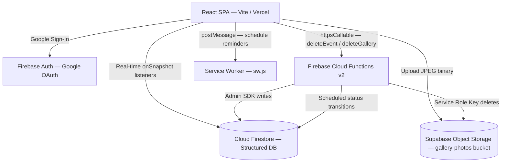
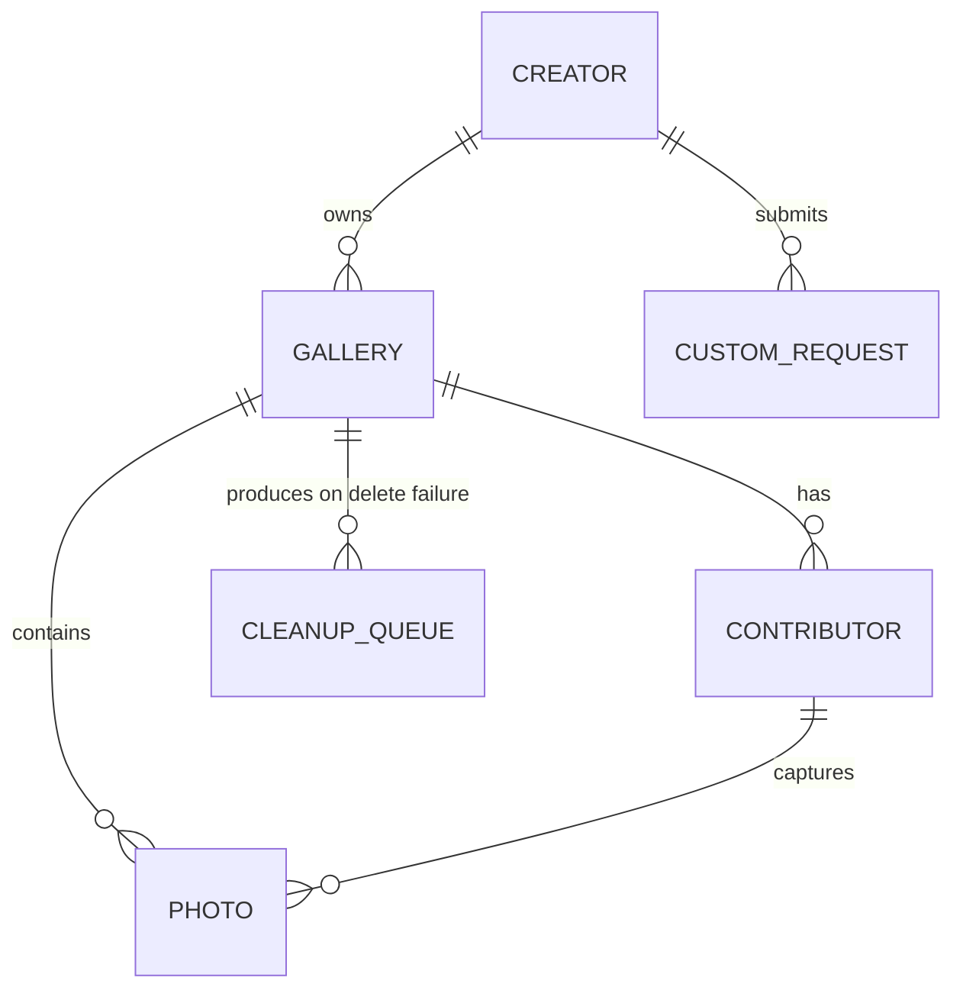
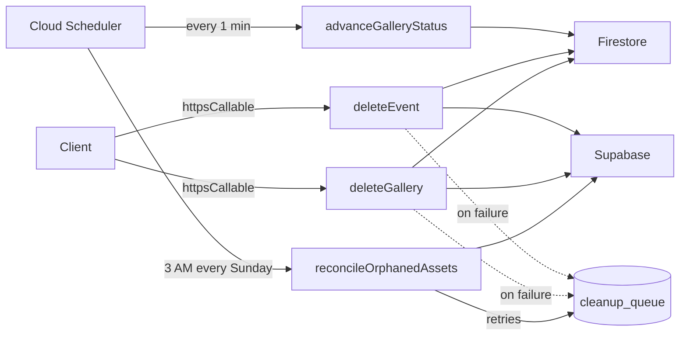
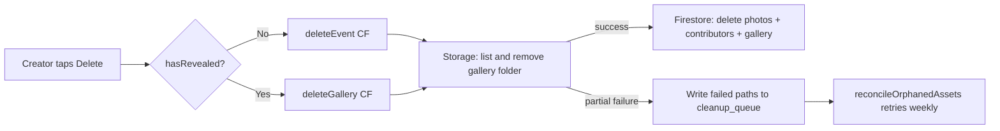

# Technical Architecture: Later (Disposable Event Camera)

> Last updated: July 2026. This document reflects the current production state of the codebase.

**Later** is a time-locked, shared disposable camera web app for events. Guests shoot photos that are sealed in a vault until a pre-set reveal time — no peeking, no deletes. This document covers the full system: backend services, data models, security rules, Cloud Functions, front-end architecture, camera mechanics, and the design system.

---

## 1. High-Level System Architecture

Later is a serverless SPA with a **tri-cloud backend**: Firebase (auth, database, functions), Supabase (binary photo storage), and Vercel (static hosting + CDN). Structured state lives in Firestore; raw binary assets live in Supabase.



### Key Technologies

| Layer | Technology | Version |
|---|---|---|
| SPA Framework | React | 19 |
| Language | TypeScript | ~5.8 |
| Build System | Vite | 6 |
| Styling | Tailwind CSS v4 | 4.1 |
| Routing | React Router DOM | 7 |
| Animations | Motion (Framer Motion) | 12 |
| Auth & Database | Firebase SDK | 12 |
| Cloud Functions | Firebase Functions v2 | (Node.js runtime) |
| Photo Storage | Supabase JS Client | 2 |
| QR Codes | qrcode.react | 4 |
| Zip Downloads | JSZip | 3 |
| Date Utilities | date-fns | 4 |
| Icons | Lucide React | latest |
| Merge Utilities | clsx / tailwind-merge | latest |

---

## 2. Database Architecture & Data Models

All structured state lives in **Cloud Firestore**. Interfaces are defined in `src/types/index.ts`. The schema is cross-referenced in `firebase-blueprint.json`.

### 2.1 Entity Relationships



### 2.2 Schemas

#### Creator Profile — `/users/{userId}`

| Field | Type | Notes |
|---|---|---|
| `email` | string | Creator's Google account email |
| `createdAt` | timestamp | Registration time |

#### Gallery — `/galleries/{galleryId}`

| Field | Type | Notes |
|---|---|---|
| `creatorId` | string | UID of the owning creator |
| `title` | string | Event name (max 100 chars) |
| `description` | string? | Optional extra details (max 500 chars) |
| `startsAt` | timestamp | When the camera opens for contributors |
| `revealAt` | timestamp | When the photo vault unlocks |
| `maxShots` | int | Max shots per contributor |
| `maxContributors` | int | Maximum guest capacity |
| `status` | upcoming / active / revealed | **Lifecycle state. Written ONLY by the `advanceGalleryStatus` Cloud Function. Clients can never modify this field.** |
| `notificationSettings` | GalleryNotificationSettings? | Per-gallery push notification config |
| `createdAt` | timestamp | Gallery creation time |
| `themeColor` | string? | Reserved |
| `welcomeMessage` | string? | Reserved |
| `coverImageUrl` | string? | Reserved |

**`GalleryNotificationSettings` sub-type:**

| Field | Type | Notes |
|---|---|---|
| `enabled` | boolean | Master switch |
| `inactivityInterval` | number | Minutes of inactivity before reminding |
| `recurrentInactivity` | boolean | Whether to repeat the inactivity reminder |
| `beforeEndReminder` | number | Minutes before reveal to send a reminder |
| `notifyOnReveal` | boolean | Send notification when vault unlocks |

#### Contributor — `/galleries/{galleryId}/contributors/{contributorId}`

| Field | Type | Notes |
|---|---|---|
| `galleryId` | string | Parent gallery reference |
| `nickname` | string | User-chosen name (max 20 chars) |
| `sessionId` | string | Client token stored in `localStorage` as `session_{galleryId}`. Prevents session hijacking. |
| `shotsTaken` | int | Shot accumulator. Enforced to increment by exactly 1 per write. |
| `createdAt` | timestamp | Join time |

#### Photo — `/galleries/{galleryId}/photos/{photoId}`

> **Breaking change from earlier versions:** `imageUrl` (public URL) has been replaced by `storagePath` (relative path inside the bucket). URL construction is centralised in `src/lib/imageUrl.ts`.

| Field | Type | Notes |
|---|---|---|
| `galleryId` | string | Parent gallery reference |
| `contributorId` | string | Who took the shot |
| `storagePath` | string | Relative Supabase path: `{galleryId}/{contributorId}/{timestamp}.jpg` |
| `width` | int? | Canvas pixel width at capture |
| `height` | int? | Canvas pixel height at capture |
| `createdAt` | timestamp | Capture time |

#### Custom Room Request — `/customRequests/{requestId}`

Used by the paid custom room workflow. Submitted by creators, reviewed by admin.

| Field | Type | Notes |
|---|---|---|
| `uid` | string | Submitting creator's UID |
| `email` | string | Creator's email |
| `eventTitle` | string | Requested event name |
| `startsAt` | timestamp | Requested start time |
| `revealAt` | timestamp | Requested reveal time |
| `guestCount` | int | Expected number of guests |
| `shotsPerPerson` | int | Shots per contributor requested |
| `status` | pending / approved / rejected | Review state |
| `galleryId` | string? | Set on approval — references the created gallery |
| `adminNote` | string? | Internal note |
| `reviewedAt` | timestamp? | When the admin acted |
| `createdAt` | timestamp | Submission time |

#### Cleanup Queue — `/cleanup_queue/{itemId}`

An internal retry queue. Written by `deleteEvent` / `deleteGallery` when a Supabase Storage batch delete partially fails. Processed weekly by `reconcileOrphanedAssets`.

| Field | Type | Notes |
|---|---|---|
| `paths` | string[] | Storage paths that failed deletion |
| `galleryId` | string | Source gallery |
| `attempts` | int | Retry counter |
| `flaggedForReview` | boolean | Set to `true` after 3 failed attempts |
| `createdAt` | timestamp | Queue entry time |

---

## 3. Security & Time-Lock Enforcement

The core promise of Later — **nobody can peek before reveal** — is enforced at the database security layer. Client-side state is never trusted for access control.

### 3.1 Firestore Security Rules (`firestore.rules`)

**Key helper functions:**

```javascript
function isSignedIn()   { return request.auth != null; }
function isVerified()   { return isSignedIn() && request.auth.token.email_verified == true; }
function isAdmin()      { return isSignedIn() && request.auth.uid == '<ADMIN_UID>'; }
function getGallery(id) { return get(/databases/$(database)/documents/galleries/$(id)).data; }
```

**1. Vault Time-Lock (photo reads):**
```javascript
// Primary fast path: check the status field written by the Cloud Function
// Fallback: raw timestamp comparison (source of truth)
allow read: if galleryStatus() == 'revealed'
             || isRevealed()   // revealAt <= request.time
             || (isVerified() && getGallery(galleryId).creatorId == request.auth.uid);
```

The creator can always read their own photos (for live stats). Guests cannot until reveal.

**2. Active Shooting Window (photo creates):**
```javascript
allow create: if (galleryStatus() == 'active' || (hasStarted() && !isRevealed()))
  && incomingData().storagePath is string
  && get(.../contributors/$(incomingData().contributorId)).data.shotsTaken < getGallery(galleryId).maxShots;
```

**3. Incremental Shot Integrity:**
```javascript
allow update: if incomingData().shotsTaken == existingData().shotsTaken + 1
               && incomingData().diff(existingData()).affectedKeys().hasOnly(['shotsTaken']);
```

Guests may only increment their shot counter by exactly one, and cannot change any other field.

**4. Gallery Status is Cloud-Function-Only:**
```javascript
allow update: if isVerified() && existingData().creatorId == request.auth.uid
  && isValidGalleryData(incomingData())
  && incomingData().status == existingData().status   // clients cannot change status
  && incomingData().creatorId == existingData().creatorId;
```

**5. Custom Room Requests:**
- Any verified user can create a request for themselves.
- Creators can read only their own requests. Admin can read all.
- Only admin can update (approve/reject). Delete is forbidden.

### 3.2 Supabase Storage Rules (`storage.rules`)

Uploads use the public anon key (client-side). Bulk deletions on gallery deletion use the service role key server-side inside Cloud Functions.

---

## 4. Cloud Functions Backend (`functions/src/`)

Firebase Cloud Functions v2 handle all privileged, time-sensitive, or destructive operations. All functions are TypeScript using the Firebase Admin SDK.



### 4.1 `advanceGalleryStatus` — Scheduled every 1 minute

Queries all galleries where `status != 'revealed'` and transitions them:
- `upcoming` → `active` when `startsAt <= now`
- any non-revealed status → `revealed` when `revealAt <= now`

Uses Firestore batched writes (max 500 per batch). This is the **only writer of the `status` field**; clients are forbidden from modifying it via security rules.

### 4.2 `deleteEvent` — HTTPS Callable (pre-reveal)

Called when a creator deletes an event **before** it has been revealed. Steps:
1. Auth check: caller must be the gallery's `creatorId`.
2. Precondition: gallery must NOT yet be revealed (rejected with `failed-precondition` if so).
3. Recursively list and delete all files in `galleryId/` in Supabase Storage (batches of 100).
4. Delete `photos` and `contributors` Firestore subcollections (batched, max 500).
5. Delete the gallery document.
6. Any failed storage paths are written to `cleanup_queue`.

### 4.3 `deleteGallery` — HTTPS Callable (post-reveal)

Called when a creator deletes a gallery **after** reveal. Same cleanup sequence as `deleteEvent` but enforces the inverse precondition: gallery MUST be revealed.

**Client routing logic** (`EventManagement.tsx`):
```typescript
const fnName = hasRevealed ? 'deleteGallery' : 'deleteEvent';
const deleteFn = httpsCallable(functions, fnName);
```

### 4.4 `reconcileOrphanedAssets` — Scheduled 3 AM every Sunday

Processes the `cleanup_queue` collection. For each item:
- Retries Supabase Storage `remove()`.
- On success: deletes the queue document.
- On failure: increments `attempts`. After 3 failures: sets `flaggedForReview: true`.

---

## 5. Front-End Architecture

### 5.1 Application Shell (`src/App.tsx`)

Firebase Auth state is held at the root and passed to `AnimatedRoutes`. Route transitions use `AnimatePresence mode="wait"`. The root div applies the global dark theme, grainy film texture, and atmospheric background gradient.

### 5.2 Routing

**Creator routes** (require Firebase auth):

| Path | Component | Purpose |
|---|---|---|
| `/` | `Home.tsx` | Splash screen & Google Sign-In |
| `/dashboard` | `Dashboard.tsx` | Creator dashboard — active events and vault |
| `/create` | `CreateEvent.tsx` | New event wizard |
| `/event/:id` | `EventManagement.tsx` | Live coordinator panel |
| `/request-custom` | `RequestCustomRoom.tsx` | Custom room request form |
| `/admin` | `AdminPanel.tsx` | Admin-only request review panel |

**Contributor routes** (no auth required):

| Path | Component | Purpose |
|---|---|---|
| `/join/:id` | `Join.tsx` | Nickname entry, capacity check, tutorial popup |
| `/capture/:id` | `Capture.tsx` | Full-screen camera experience |
| `/gallery/:id` | `GalleryView.tsx` | Post-reveal photo gallery |

### 5.3 Custom Room Request & Admin Workflow

Later operates a two-tier model:
- **Free plan**: Up to 10 contributors, up to 12 shots per guest. Self-serve via `/create`.
- **Custom / Paid**: Higher limits. Creators submit a request via `RequestCustomRoom.tsx`, which writes to the `customRequests` Firestore collection.

The admin reviews requests at `AdminPanel.tsx` (`/admin`), gated by `VITE_ADMIN_UID` env var + the hardcoded admin UID in `firestore.rules`. On approval, the admin directly creates a gallery document under the requester's `creatorId`, which then appears automatically in their dashboard.

---

## 6. Key Front-End Technical Implementations

### 6.1 Image URL Centralisation (`src/lib/imageUrl.ts`)

Photos store a relative `storagePath` in Firestore. Public URLs are constructed on demand:

```typescript
// Returns: {SUPABASE_URL}/storage/v1/object/public/gallery-photos/{storagePath}
export function getThumbnailUrl(storagePath: string): string
export function getFullSizeUrl(storagePath: string): string
export function getRawUrl(storagePath: string): string
```

All three currently return the same raw public URL (Supabase Image Transformations are a paid feature), but the abstraction allows transparent future upgrades.

### 6.2 Custom Camera & Dual Orientation Model (`src/pages/Capture.tsx`)

The camera maintains **two independent orientation angles**:

| State | Source | Purpose |
|---|---|---|
| `viewportOrientationAngle` | `window.screen.orientation.angle` | CSS counter-rotation of the viewfinder container |
| `deviceOrientationAngle` | `DeviceOrientationEvent` via `Math.atan2(-gamma, beta)` | Canvas rotation at capture; UI icon counter-rotation |

This separation is critical: using only the viewport angle would break the camera when rotation lock is enabled. The accelerometer model is device-physical and rotation-lock-independent.

**Accelerometer-based orientation detection:**
```typescript
const handleDeviceOrientation = (event: DeviceOrientationEvent) => {
  const magnitude = Math.sqrt(beta * beta + gamma * gamma);
  if (magnitude >= 25) {   // ignore flat/ambiguous orientations
    let angle = Math.round(Math.atan2(-gamma, beta) * (180 / Math.PI));
    // snap to 0, 90, 180, 270 and remap to physicalOrientation
  }
};
```

**Image capture normalisation:**
Before drawing to canvas, if the device is physically landscape but the video stream is portrait (common on mobile), the canvas is rotated 90° in the correct direction — clockwise for landscape-right (90°), counter-clockwise for landscape-left (270°). Saved pixel data is always correctly oriented; no EXIF metadata is relied upon.

```typescript
const shouldRotate = isDeviceLandscape && isVideoPortrait;
if (shouldRotate) {
  const rotDir = normAngle === 90 ? 1 : -1;
  ctx.translate(effectiveW / 2, effectiveH / 2);
  ctx.rotate((rotDir * Math.PI) / 2);
  ctx.drawImage(video, ...);
}
```

**Feature detection:**
- **Torch**: `track.getCapabilities().torch` → `applyConstraints({ torch: true })` for 650ms.
- **Native Zoom**: `track.getCapabilities().zoom` → native constraints if available, CSS `scale()` fallback.
- **Tap-to-Focus**: `focusMode: 'single-shot'` with `pointsOfInterest` + animated focus ring.

### 6.3 Push Notifications & Service Worker (`src/lib/notifications.ts`)

Later uses a Service Worker (`/sw.js`) for scheduling local push notifications — no server-side push infrastructure required.

```
Capture.tsx → notifications.ts → postMessage → sw.js → Notification API
```

**Notification types:**
- **Inactivity reminder**: fires after a configurable interval if the user has unused shots and the app is backgrounded.
- **Before-end reminder**: fires N minutes before the reveal time.
- **Reveal notification**: fires when `revealAt` is reached.

**Key platform behaviour:**
- On iOS, notifications only work when the app is installed as a PWA. `canNotify()` gates on `isPWA()` for iOS users. `NotificationPrompt.tsx` surfaces Add-to-Home-Screen instructions in this case instead of a permission request.
- SW message protocol: `SCHEDULE_REMINDERS`, `PAGE_VISIBLE`, `PHOTO_TAKEN`, `CANCEL_REMINDERS`.

### 6.4 60 FPS Swipeable Lightbox Carousel (`src/pages/GalleryView.tsx`)

React state updates on every `pointermove` cause visible lag on mobile. The `LightboxCarousel` component bypasses React's reconciler for drag gestures:

1. **Three-slide DOM strip**: Only `[prev, current, next]` images are rendered, laid in a horizontal row translated left by `-100vw` so `current` is centred.
2. **Ref-based drag**: `onPointerMove` writes directly to `stripRef.current.style.transform` — no `setState`, no re-render.
3. **Snap-on-release**: If drag distance > 60px or velocity > 0.3 px/ms, a CSS transition completes the slide, then a single `setState` updates the current index and resets the strip with new neighbours.

---

## 7. Library Modules (`src/lib/`)

| Module | Purpose |
|---|---|
| `firebase.ts` | App init; exports `auth`, `db`, `functions`; `handleFirestoreError` (throws) and `logFirestoreError` (logs only — safe for `onSnapshot` callbacks) |
| `supabase.ts` | Client init with URL normalisation; `uploadPhoto()` using ArrayBuffer path for correct MIME; `deletePhoto()` non-throwing |
| `imageUrl.ts` | Centralised public URL construction from relative `storagePath` |
| `notifications.ts` | SW registration; permission flow; SW message protocol helpers |
| `utils.ts` | `cn()` — `clsx` + `tailwind-merge` for conditional class composition |

---

## 8. UI Components (`src/components/`)

| Component | Purpose |
|---|---|
| `PageWrapper.tsx` | Responsive container — centers to `max-w-md`, fade-in motion |
| `Badge.tsx` | Pill-shaped status label |
| `Button.tsx` | Styled button with `default` and `accent` variants |
| `LoadingScreen.tsx` | Full-screen pulsing logo during Firebase auth state resolution |
| `TutorialPopup.tsx` | First-join modal explaining shot limits, vault mechanics, camera controls, and reveal time |
| `NotificationPrompt.tsx` | Slide-up notification permission prompt with iOS PWA detection |

---

## 9. UI/UX Design System

### 9.1 Design Tokens (`src/index.css`)

| Token | Value | Usage |
|---|---|---|
| `--color-bg` | `#080808` | Page background — deep obsidian |
| `--color-card` | `#121212` | Elevated card surfaces |
| `--color-accent` | `#E5C3A6` | Warm champagne gold — primary highlight |
| `--color-text-muted` | `#888888` | Secondary labels |
| `font-sans` | Inter | Body text, controls |
| `font-serif` | Playfair Display | Italic headings, titles |
| `font-mono` | JetBrains Mono | Stats, countdowns, codes |

### 9.2 Atmospheric Layering

- **`.atmosphere`**: Fixed, non-interactive radial gradient — warm `#1a1512` at top-right, cool `#0d0d0d` at bottom-left — simulates analog lens leakage.
- **`.grainy`**: Blended SVG film grain overlay at 3% opacity in `overlay` blend mode — replicates physical film grain across all screens.

---

## 10. Deployment & Environment

### 10.1 Hosting

- **Frontend**: Vercel — all unmatched routes rewrite to `index.html` for client-side routing.
- **Cloud Functions**: `firebase deploy --only functions`
- **Firestore rules**: `firebase deploy --only firestore:rules`
- **Favicon**: SVG favicon at `public/favicon.svg`, linked in `index.html` with `type="image/svg+xml"`.

### 10.2 Environment Variables

**Frontend (`.env.local`):**

| Variable | Purpose |
|---|---|
| `VITE_SUPABASE_URL` | Supabase project API URL |
| `VITE_SUPABASE_ANON_KEY` | Public anon key for client-side storage uploads |
| `VITE_ADMIN_UID` | Firebase UID of the admin user (gates `/admin` route client-side) |

**Cloud Functions (Firebase Secret Manager / env config):**

| Variable | Purpose |
|---|---|
| `SUPABASE_URL` | Supabase project URL (server-side) |
| `SUPABASE_SERVICE_ROLE_KEY` | Service role key for privileged storage deletions |

### 10.3 Firebase Configuration

Firebase app config is in `firebase-applet-config.json` (gitignored), imported directly in `src/lib/firebase.ts`. Includes a `firestoreDatabaseId` field to target a named Firestore database instance.

---

## 11. Storage Architecture

### 11.1 Upload Flow

```
takePhoto()
  → canvas.toBlob()  → JPEG at quality 0.92
  → blob.arrayBuffer()
  → supabase.storage.from('gallery-photos').upload(storagePath, arrayBuffer, { contentType: 'image/jpeg' })
  → addDoc(photos, { storagePath, width, height, createdAt })
  → updateDoc(contributor, { shotsTaken: increment(1) })
```

Photos upload as `ArrayBuffer` with an explicit `Content-Type: image/jpeg` header (not multipart FormData) to ensure correct MIME handling.

### 11.2 Path Convention

```
gallery-photos/
  {galleryId}/
    {contributorId}/
      {Date.now()}.jpg
```

### 11.3 Deletion Lifecycle



If the Cloud Function call itself fails (e.g. network), `EventManagement.tsx` falls back to client-side deletion using the anon Supabase key and the Firestore client SDK. A final `alert()` surfaces if both paths fail.
