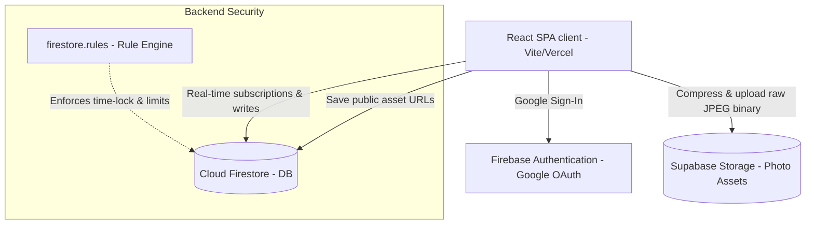
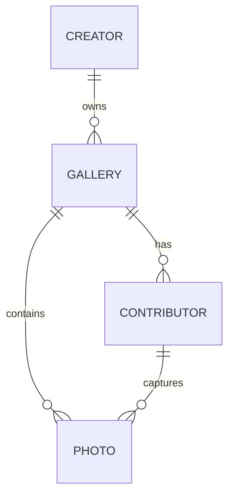

# Technical Architecture: Later (Disposable Event Camera)

This document provides a comprehensive technical overview of the **Later** application—a time-locked, shared disposable camera app designed for events. It covers the high-level system components, database schemas, security rule enforcements, front-end mechanics, camera handling, and the design aesthetics.

---

## 1. High-Level System Architecture

**Later** is structured as a serverless single-page application (SPA) using a dual-cloud backend system (**Firebase** + **Supabase**) to decouple real-time structured state from heavy binary assets:



### Key Technologies
- **Core SPA Framework**: [React 19](file:///c:/Users/randi/Personal/Projects/Later/package.json#L26) & [TypeScript](file:///c:/Users/randi/Personal/Projects/Later/package.json#L39)
- **Build System & Tooling**: [Vite 6](file:///c:/Users/randi/Personal/Projects/Later/package.json#L30) with [Tailwind CSS v4](file:///c:/Users/randi/Personal/Projects/Later/package.json#L37)
- **Database & Auth**: [Firebase v12 SDK](file:///c:/Users/randi/Personal/Projects/Later/package.json#L22) (Authentication & Cloud Firestore)
- **Media Hosting**: [Supabase JS Client](file:///c:/Users/randi/Personal/Projects/Later/package.json#L15) (Supabase Object Storage)
- **Routing**: [React Router DOM v7](file:///c:/Users/randi/Personal/Projects/Later/package.json#L28)
- **Animations**: [Motion (Framer Motion) v12](file:///c:/Users/randi/Personal/Projects/Later/package.json#L24)

---

## 2. Database Architecture & Data Models

The structured database is managed in **Cloud Firestore** under a relational hierarchical structure. The schema mapping is detailed in [firebase-blueprint.json](file:///c:/Users/randi/Personal/Projects/Later/firebase-blueprint.json) and represented by interfaces in [src/types/index.ts](file:///c:/Users/randi/Personal/Projects/Later/src/types/index.ts).

### 2.1 Entity Relationships



### 2.2 Schemas

#### Creator Profile (`/users/{userId}`)
Represents registered users who can initialize and manage disposable camera events.
- **`email`** (string, email): Creator's Google account email.
- **`createdAt`** (timestamp): Registration timestamp.

#### Gallery (`/galleries/{galleryId}`)
An event instance representing the shared camera vault.
- **`creatorId`** (string): Foreign key pointing to the owning Creator's UID.
- **`title`** (string): The title/name of the event (e.g. "The Miller Wedding").
- **`description`** (string, optional): Extra details/notes.
- **`startsAt`** (timestamp): The exact date and time the camera becomes active for shooting.
- **`revealAt`** (timestamp): The exact date and time the photo vault unlocks.
- **`maxShots`** (integer): Max shots allowed per unique contributor.
- **`maxContributors`** (integer): The capacity limit of unique guests for the event.
- **`createdAt`** (timestamp): Gallery instantiation timestamp.
- *Styling/Customization (Reserved)*: `themeColor`, `welcomeMessage`, `coverImageUrl`.

#### Contributor (`/galleries/{galleryId}/contributors/{contributorId}`)
A guest who joins a specific gallery to capture photos.
- **`galleryId`** (string): Parent gallery reference.
- **`nickname`** (string): User-selected identifier (maximum 20 characters).
- **`sessionId`** (string): Randomly generated client token stored in client local storage to prevent session spoofing.
- **`shotsTaken`** (integer): Accumulator monitoring the amount of shots fired. Defaults to `0`.
- **`createdAt`** (timestamp): Time of entry.

#### Photo (`/galleries/{galleryId}/photos/{photoId}`)
A photo asset metadata record.
- **`galleryId`** (string): Parent gallery reference.
- **`contributorId`** (string): ID of the contributor who took the photo.
- **`imageUrl`** (string): Public asset URL retrieved from Supabase Storage.
- **`createdAt`** (timestamp): Capture timestamp.

---

## 3. Security & Time-Lock Enforcement

The signature security characteristic of **Later** is that the "no-peeking" mechanism is enforced **server-side** at the database security layer, rather than relying on client-side state filters.

### 3.1 Security Policies (`firestore.rules`)
Firestore operations are protected by rules defined in [firestore.rules](file:///c:/Users/randi/Personal/Projects/Later/firestore.rules):

1. **Vault Time-Lock (Private Reads)**:
   ```javascript
   match /photos/{photoId} {
     function isRevealed() {
       return get(/databases/$(database)/documents/galleries/$(galleryId)).data.revealAt <= request.time;
     }
     allow read: if isRevealed();
   }
   ```
   *Implication*: No contributor, guest, or even creator can query or retrieve document data or image URLs inside the `/photos` collection until the clock ticks past `revealAt`.

2. **Active Shooting Windows**:
   ```javascript
   function hasStarted() {
     return get(/databases/$(database)/documents/galleries/$(galleryId)).data.startsAt <= request.time;
   }
   allow create: if hasStarted() && !isRevealed() && ...
   ```
   *Implication*: Photo submissions are rejected if the event has not started or if the gallery has already been revealed.

3. **Incremental Shot Integrity**:
   Guests cannot freely edit their profile details. They are only allowed to increment their count by exactly `1` per capture:
   ```javascript
   allow update: if isValidContributor(incomingData())
     && incomingData().sessionId == existingData().sessionId
     && incomingData().createdAt == existingData().createdAt
     && (
       incomingData().shotsTaken == existingData().shotsTaken + 1 
       && incomingData().diff(existingData()).affectedKeys().hasOnly(['shotsTaken'])
     );
   ```

4. **Dynamic Capacity Constraints**:
   A photo can only be uploaded if the database verifies the contributor has remaining shots left:
   ```javascript
   && get(/databases/$(database)/documents/galleries/$(galleryId)/contributors/$(incomingData().contributorId)).data.shotsTaken < getGallery(galleryId).maxShots
   ```

---

## 4. Storage Architecture

Photos are saved in **Supabase Object Storage** instead of Firebase Storage to leverage custom asset buckets. The storage interaction is encapsulated in [src/lib/supabase.ts](file:///c:/Users/randi/Personal/Projects/Later/src/lib/supabase.ts).

### 4.1 Asset Upload Flow
1. The frontend custom camera takes a picture and renders it as an HTML5 Canvas context.
2. The canvas is serialized into a high-quality compressed JPEG blob (`quality: 0.8`).
3. The client uploads the binary object directly using Supabase's standard upload path.
4. The client retrieves the public asset URL and registers it in Firestore.

```
Canvas Context ──> JPEG Blob (quality: 0.8) ──> Supabase Storage ──> Public URL ──> Firestore Photo Document
```

### 4.2 File Conventions
Storage files are written inside the `gallery-photos` bucket using a structured folder hierarchy:
```
{galleryId}/{contributorId}/{timestamp}.jpg
```
This isolates assets by event and user session, preventing overrides.

### 4.3 Asset Deletion
If a creator decides to delete a gallery (in [src/pages/EventManagement.tsx](file:///c:/Users/randi/Personal/Projects/Later/src/pages/EventManagement.tsx#L73-L106)), the client triggers a batch storage cleanup:
1. Fetch all photo records for the target gallery from Firestore.
2. For each photo, parse the public URL to extract the relative storage path inside the bucket.
3. Call `supabase.storage.from('gallery-photos').remove([path])` via [deletePhoto](file:///c:/Users/randi/Personal/Projects/Later/src/lib/supabase.ts#L92-L117).
4. Delete corresponding Firestore documents (`photos`, `contributors`, and `gallery`).

---

## 5. Front-End Architecture & View Flows

The front-end app behaves like a progressive mobile web app. Responsive styles target viewport containers bounded to `max-w-md` (centered on desktop displays) to match a physical smartphone aspect ratio.

### 5.1 Routing Configuration
Defined in [src/App.tsx](file:///c:/Users/randi/Personal/Projects/Later/src/App.tsx), utilizing `AnimatePresence` from Framer Motion for smooth slide-transitions:

- **Creator Pages**:
  - `/` ([Home.tsx](file:///c:/Users/randi/Personal/Projects/Later/src/pages/Home.tsx)): Splash screen displaying authentication entry.
  - `/dashboard` ([Dashboard.tsx](file:///c:/Users/randi/Personal/Projects/Later/src/pages/Dashboard.tsx)): Creator dashboard. Displays ongoing events vs. past events ("The Vault") and a "New Event" creation trigger.
  - `/create` ([CreateEvent.tsx](file:///c:/Users/randi/Personal/Projects/Later/src/pages/CreateEvent.tsx)): Setup page to name the event, schedule start/reveal times, and configure shot limits and guest capacity.
  - `/event/:id` ([EventManagement.tsx](file:///c:/Users/randi/Personal/Projects/Later/src/pages/EventManagement.tsx)): Live coordinator panel. Houses the invite QR code generator, live participant statistics, and a guest registry listing.
- **Contributor Pages**:
  - `/join/:id` ([Join.tsx](file:///c:/Users/randi/Personal/Projects/Later/src/pages/Join.tsx)): Welcome screen prompting guests for a nickname. Enforces event-start checks and capacity blocks. Saves references into local storage (`contributor_{id}` and `session_{id}`).
  - `/capture/:id` ([Capture.tsx](file:///c:/Users/randi/Personal/Projects/Later/src/pages/Capture.tsx)): Full-screen native web camera experience.
  - `/gallery/:id` ([GalleryView.tsx](file:///c:/Users/randi/Personal/Projects/Later/src/pages/GalleryView.tsx)): Masonry-inspired grid showcasing unlocked photos after the reveal time is met.

---

## 6. Key Front-End Technical Implementations

### 6.1 Custom In-Browser Camera & Media Capture
The custom camera in [src/pages/Capture.tsx](file:///c:/Users/randi/Personal/Projects/Later/src/pages/Capture.tsx) leverages browser API constraints:
- **Active Streaming**: Integrates `navigator.mediaDevices.getUserMedia({ video: { facingMode }, audio: false })` outputted into an HTML5 `<video autoplay playsinline>` element.
- **Orientation Correction**: Mobile web uploads often experience rotation offsets because device sensors write orientation metadata that standard browsers don't apply automatically during raw canvas copies. `takePhoto` calculates the screen orientation angle:
  ```typescript
  const orientAngle = window.screen?.orientation?.angle ?? 0;
  const isDeviceLandscape = orientAngle === 90 || orientAngle === 270;
  const isVideoPortrait = height > width;
  ```
  If these variables indicate an orientation mismatch, the canvas matrix is rotated by 90 degrees (`ctx.rotate`) and translated before drawing to match human expectations.
- **Flash/Torch Support**: Interrogates the camera track capabilities using `track.getCapabilities()`. If `caps.torch` is validated, clicking the toggle fires `track.applyConstraints({ advanced: [{ torch: true }] })` to pulse the device flashlight synchronously during shutter triggers.

### 6.2 60 FPS Swipable Lightbox Carousel
A performance bottleneck in mobile browser image viewers is gesture-swiping. Animating with standard React state updates triggers rapid DOM re-renders, causing lag. 

[src/pages/GalleryView.tsx](file:///c:/Users/randi/Personal/Projects/Later/src/pages/GalleryView.tsx#L23) solves this via a **ref-driven CSS translate mechanism** under the `LightboxCarousel` component:
1. **Three-Slide Strip Pattern**: Instead of rendering all gallery photos, the DOM only renders 3 active items at any point: `[prev, current, next]`. These are arranged in a horizontal row, translated left by `-100vw` so the `current` slide sits center stage.
2. **Ref-Based Pointer Capture**: The `onPointerMove` event measures delta movement from starting coordinates (`startX`, `startY`). Instead of setting React state, it modifies the element's style attribute directly:
   ```typescript
   stripRef.current.style.transform = `translateX(${getBaseOffset() + deltaX}px)`;
   ```
   This bypasses React's diffing engine, delivering 60 FPS transitions driven by hardware-accelerated GPU transforms.
3. **Threshold Commitment**: On pointer release, if the drag distance exceeds `60px` or a flick velocity exceeds `0.3 px/ms`, the strip applies a smooth transition (`transform 0.3s cubic-bezier(...)`), completes the translation, and schedules a single React state change to slide the next index into focus, resetting the strip layout.

---

## 7. UI/UX Design System & Aesthetics

The design of **Later** is optimized for high-visual-impact dark aesthetics, capturing the analog, raw, grainy feel of retro film inside a premium digital frame.

### 7.1 Design Tokens (`src/index.css`)
Custom variables defined inside [src/index.css](file:///c:/Users/randi/Personal/Projects/Later/src/index.css) drive the styling consistency:
- **`--color-bg`**: `#080808` — Deep obsidian charcoal.
- **`--color-card`**: `#121212` — Dark elevated cards.
- **`--color-accent`**: `#E5C3A6` — A warm, champagne-gold pastel hue serving as the highlight color.
- **`--color-text-muted`**: `#888888` — Neutral gray for headers and status tags.
- **Fonts**:
  - `font-sans`: `Inter` (neutral readability for settings and options).
  - `font-serif`: `Playfair Display` (italicized headings to convey elegance).
  - `font-mono`: `JetBrains Mono` (digitized, raw display stats and countdown times).

### 7.2 Atmospheric Layering
To prevent the dark mode from feeling flat, two distinct CSS elements are used:
- **`.atmosphere`**: A fixed, non-interactive back layer applying multi-point radial gradients (`#1a1512` at top-right, `#0d0d0d` at bottom-left) to simulate warm lens leakage.
- **`.grainy` Noise Texture**: An overlay layer using a blended film grain SVG with low opacity (`0.03`) and an `overlay` mix-blend mode. This replicates the visual texture of physical film grain across the screens.

---

## 8. Deployment & Environment Settings

The project is preconfigured for deployment on **Vercel** via [vercel.json](file:///c:/Users/randi/Personal/Projects/Later/vercel.json), setting Vite redirects to index.html to allow client-side route handling.

### 8.1 Environment Variables
Key configuration tokens are specified inside `.env.local` based on [.env.example](file:///c:/Users/randi/Personal/Projects/Later/.env.example):
- `VITE_SUPABASE_URL`: API gateway endpoint for the Supabase instance.
- `VITE_SUPABASE_ANON_KEY`: Public client-safe access token for storage uploads.
